# 简介

基于插桩在Servlet内部对配置路径进行反向代理，实现将请求转发到其他服务器，目前支持基于Spring MVC和Spring Boot的应用。

# 快速开始

## 配置简介
配置文件agentConfig.yml位于模块zary-honeynet-sniffer-agent模块下resources下
```shell
#匹配模式到目标URL的映射列表，目前支持带*的路径匹配和全路径匹配
#匹配优先级是从上到下，匹配到就停止匹配
#注意/index/*可以匹配/index/、/index、/index/a、/index/a/b等

#当type为proxy时，stripPrefix: true会去掉匹配的父路径，如:/index/a匹配到/index/*，去掉/index,实际uri成/a

#当type为file时，target为resources下的相对路径

#目前type类型包括：301(永久重定向)、302(重定向)、file(媒体文件包括html、json、xml、txt等等)、script脚本插入及添加cookie
routes:
  - path: /resources/templates/dianwang03/index.html
    type: script
    target: script/test.script
    cookies:
      - name: test
        value: 123
        cookiePath: /
      - name: test2
        value: 1234
        cookiePath: /
  - path: /404
    type: 404
  - path: /403
    type: 403
  - path: /500
    type: 500
  - path: /301
    type: 301
    target: https://www.baidu.com/
  - path: /302
    type: 302
    target: https://blog.csdn.net/qq_24365213/article/details/78225085
  - path: /txt
    type: file
    target: txt/1.txt
  - path: /json
    type: file
    target: json/all.json
  - path: /login
    type: file
    target: html/login.html
  - path: /pub/version
    type: proxy
    target: http://192.168.120.144:3004
    stripPrefix: false
  - path: /pub/*
    type: proxy
    target: http://192.168.120.144:3004
    stripPrefix: false
  - path: /*
    type: proxy
    target: http://127.0.0.1:3005
    stripPrefix: false
```

## 部署使用
```shell
mvn clean package -DskipTests
```
将zary-honeynet-sniffer-x-packages/sniffer-agent目录下所有文件拷贝到需要执行jar的目录下

执行java -javaagent:zary-honeynet-sniffer-xxx-agent.xxx.jar -jar xxx.jar即可

## 案例展示
启一个空壳（无任何Controller）SpringBoot程序，使用Zary Honeynet Sniffer X插件，拦截请求。

### 1.配置反向代理proxy相关示例

agentConfig.yml配置如下：
```shell
# 将api-upms下的请求交由192.168.120.144:3002处理
routes:
  - path: /api-upms/*
    type: proxy
    target: http://192.168.120.144:3002
    stripPrefix: false
```
比较下面两张图可以知晓请求头也被传予目标服务

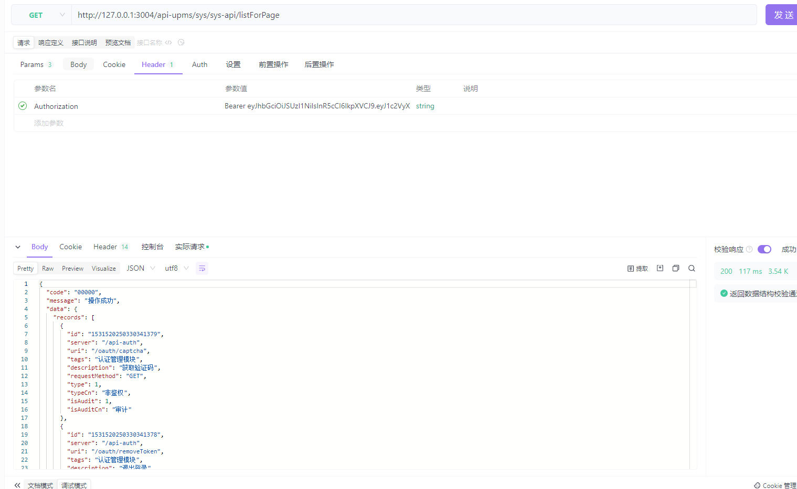

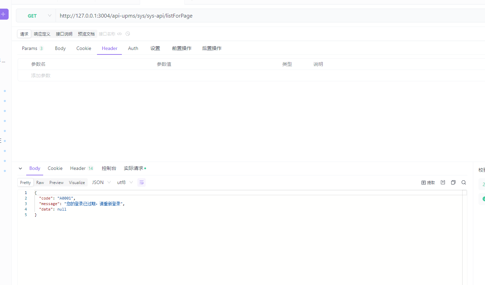

agentConfig.yml配置如下：
```shell
# 将/pub下的请求交由192.168.120.144:3004处理
routes:
  - path: /pub/*
    type: proxy
    target: http://192.168.120.144:3004
    stripPrefix: false
```
由于/sys/sys-api/judgeGrant没有被代理，并且原SpringBoot也未提供该接口，所以404

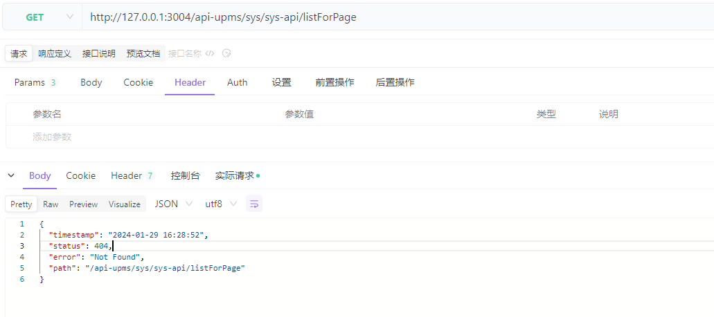

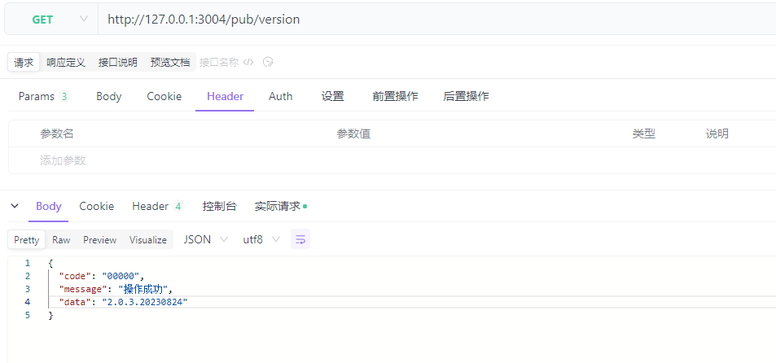

agentConfig.yml配置如下：
```shell
# 将/pub下的请求交由192.168.120.144:3004处理，其他请求交由192.168.120.144:3002处理
routes:
  - path: /pub/*
    type: proxy
    target: http://192.168.120.144:3004
    stripPrefix: false
  - path: /*
    type: proxy
    target: http://192.168.120.144:3002
    stripPrefix: false    
```
越靠前的route处理优先级越高


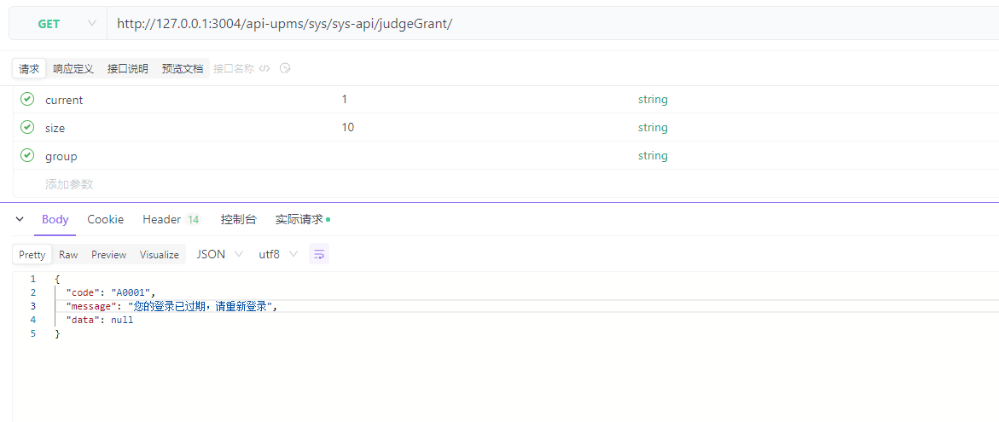

### 2.配置直接返回媒体文件(媒体文件包括html、json、xml、txt、mp3、mp4等等)

agentConfig.yml配置如下：
```shell
routes:
  - path: /txt
    type: file
    target: txt/1.txt
  - path: /json
    type: file
    target: json/all.json
  - path: /login
    type: file
    target: html/login.html
```
target为媒体文件相对路径

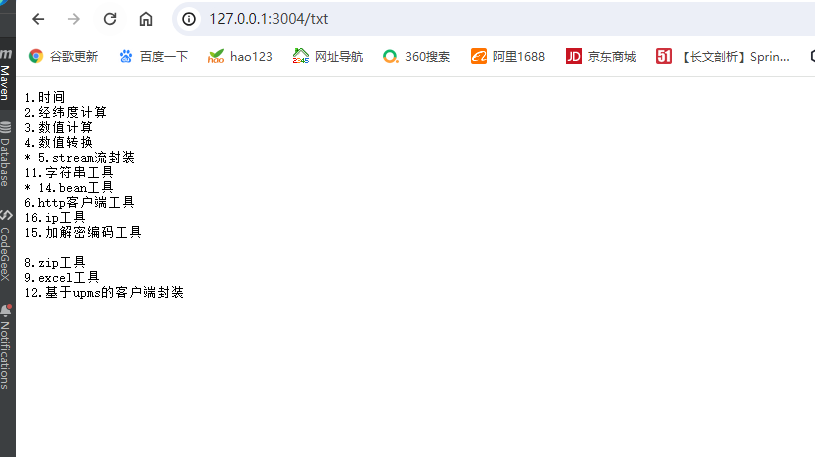

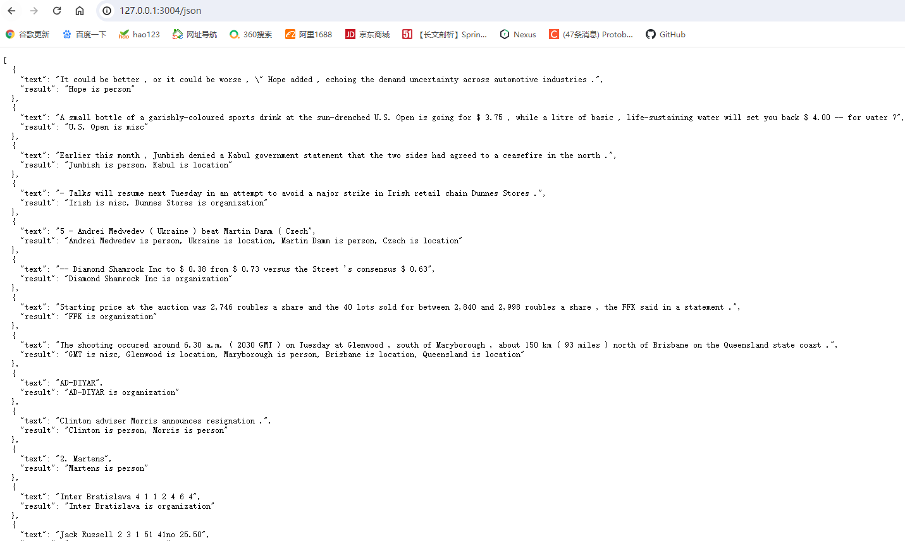

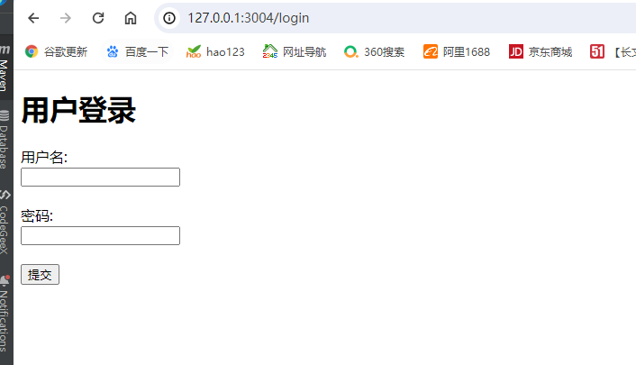

### 3.配置重定向到其他地址

agentConfig.yml配置如下：
```shell
routes:
  - path: /301
    type: 301
    target: https://www.baidu.com/
  - path: /302
    type: 302
    target: https://blog.csdn.net/qq_24365213/article/details/78225085
```
站内地址，直接写 /uri（uri为你的站内有的地址） 即可

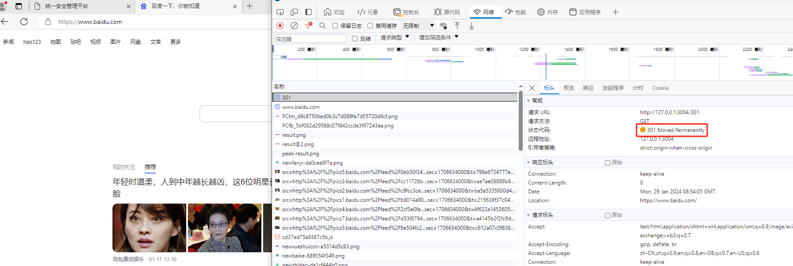

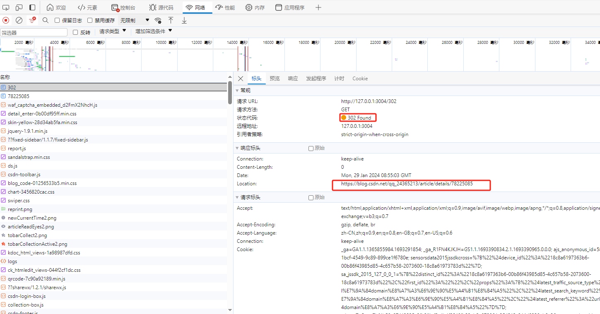

### 4.配置插入脚本或增加cookie

agentConfig.yml配置如下：
```shell
routes:
  - path: /admin/u/toLogin
    type: script
    target: script/test.script
    cookies:
      - name: test
        value: 123
        cookiePath: /
      - name: test2
        value: 1234
        cookiePath: /
```

target为要插入的脚本

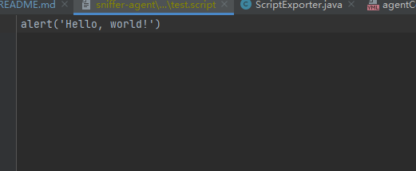

效果如下：

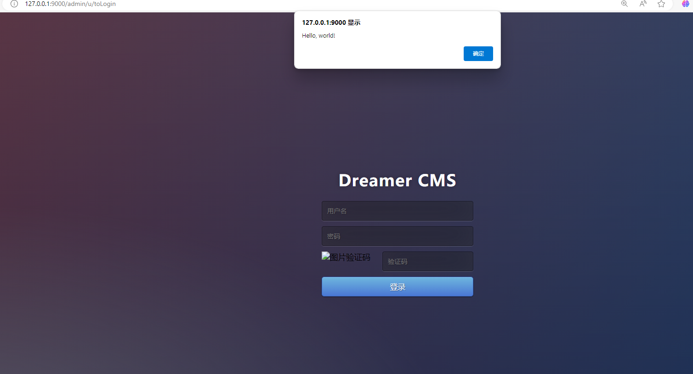

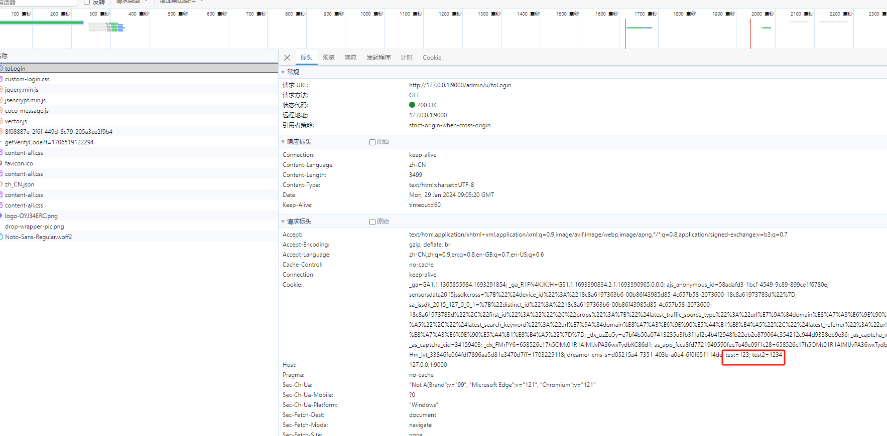